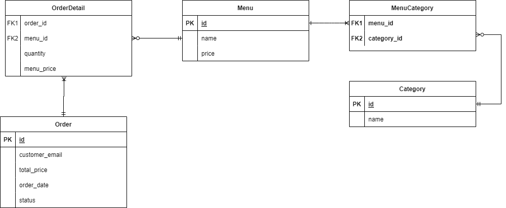

# Rails on Replit

This is a template to get you started with Rails on Replit. It's ready to go so you can just hit run and start coding!

This template was generated using `rails new` (after you install the `rails` gem from the packager sidebar) so you can always do that if you prefer to set it up from scratch. The only had two make config changes we had to make to run it on Replit:

- bind the app on `0.0.0.0` instead of `localhost` (see `.replit`)
- allow `*.repl.co` hosts (see `config/environments/development.rb`)
- allow the app to be iframed on `replit.com` (see `config/application.rb`)

## Running the app

Simple hit run! You can edit the run command from the `.replit` file.

## Running commands

Start every command with `bundle exec` so that it runs in the context of the installed gems environment. The console pane will give you output from the server but you can run arbitrary command from the shell without stopping the server.

## Database

SQLite would work in development but we don't recommend running it in production. Instead look into using the built-in [Replit database](http://docs.replit.com/misc/database). Otherwise you are welcome to connect databases from your favorite provider. 

## Help

If you need help you might be able to find an answer on our [docs](https://docs.replit.com) page. Alternatively you can [ask in the community](https://replit.com/talk/ask). Feel free to report bugs [here](https://replit.com/bugs) and give us feedback [here](https://Replit/feedback).

## Note
Here is the erd I made for this final project (Gigih Family Catering ERD):

 

To be able to display the portion textfield on the new page and edit on the order, we must first select the menu by clicking the checkbox, after clicking the checkbox, the portion textfield will appear under the clicked menu checkbox.

 

/orders -> to view and access all orders

/ -> to view and access all orders too

/menus -> to view and access all menus

/categories -> to view and access all categories

**If you want to reset the orders filter or back with no filters in orders, you must click the Reset Filter button below the drop down**
